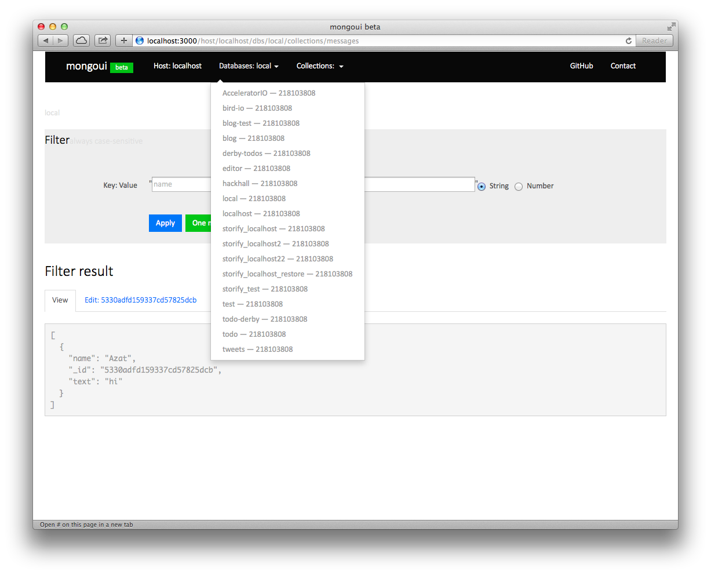
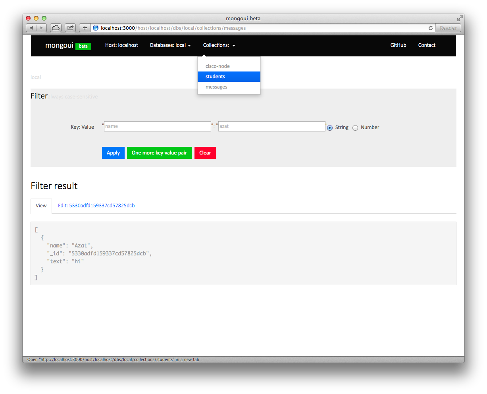
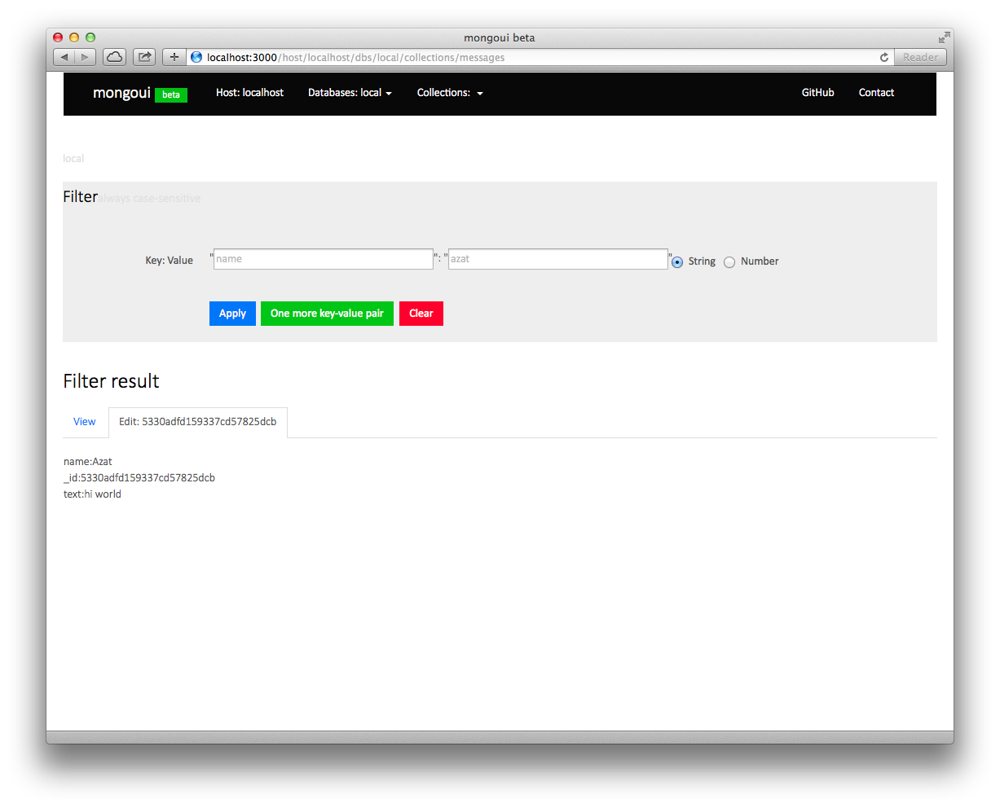
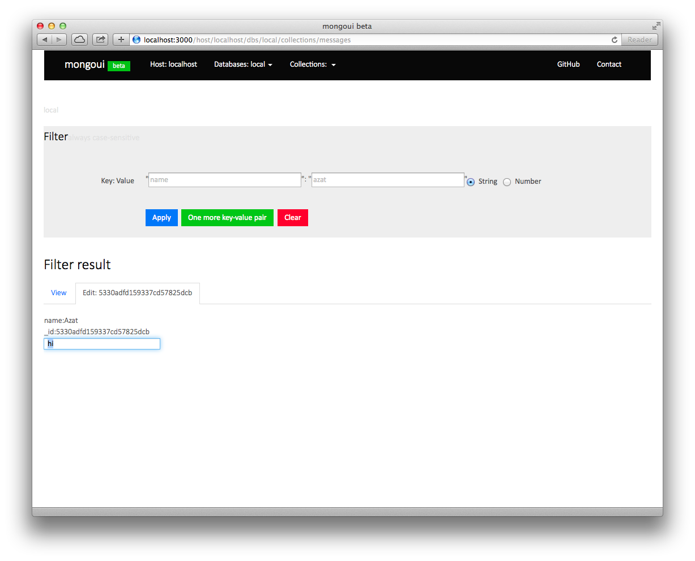
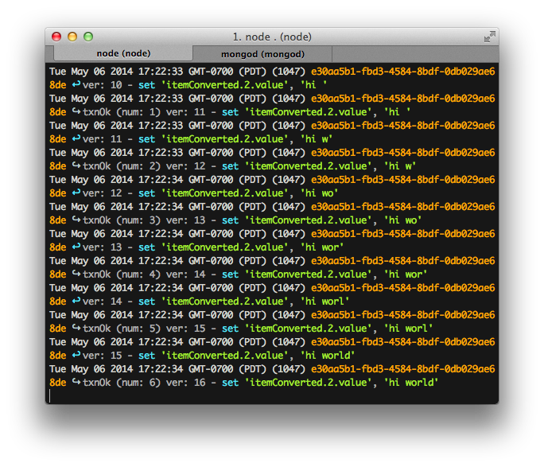
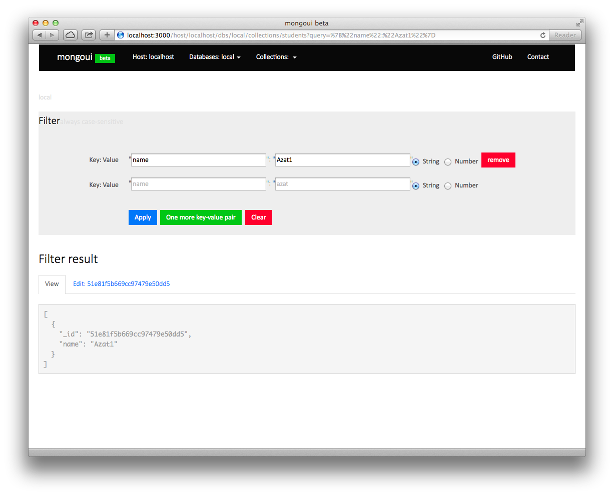

# MongoUI

MongoUI (mongoui) is a web browser admin interface for MongoDB. Currently a standalone tool (run as an app locally or on your server); middleware later.

## Branches

* Master — major releases, main branch
* Develop — current development branch (make your pull requests here)

## Why

Tired of typing `db.users.findOne({_id:ObjectId(...)})` just to look up data structure. Even more typing to modify the data. Can't find Node.js implementaton (not true any more, there is [exprss-mongo](https://github.com/andzdroid/mongo-express)).

## Screenshots

Select a database from the local server (can be remote server):

Select a collection from the dropdown menu:

Collection view with a single element (if there's only one element, it can be edited):

Edit an item (if there's only one element, it can be edited):

Editing text property (if there's only one element, it can be edited):

Server logs (real-time updates as you type):

Filter/find based on property(ies):

## How to Use

### Installation

`git clone git@github.com:azat-co/mongoui`

or

`npm install mongoui`

### Running the app

Assuming that MongoDB is running, to start the server run:

  $ node .

or:

  $ node index.js

### Configs

Copy `config_default.json` file as `config.json`:

	$ cp config_default.json config.json

Modify as needed (remote databases should work just fine!).

### Using

Open <http://localhost:3000/> in your favorite browser. If you use Chrome, there is a nice extension for viewing raw json: Chrome extension.

Optional: Download and install [JSONView Chrome extension](https://chrome.google.com/webstore/detail/jsonview/chklaanhfefbnpoihckbnefhakgolnmc) to view JSON in a human readable format.

## Contributors

Via `git shortlog -s -n`:

    61  Azat Mardanov
    14  cultofmetatron
     1  Jan Carlo Viray

## TODO

The list is in the GitHub Issues.

## Contributing

Pull requests are always welcome as long as an accompanying test case is
associated.

This project is configured to use [git
flow](https://github.com/nvie/gitflow/) and the following conventions
are used:

* ``develop`` - represents current active development and can possibly be
  unstable.

* ``master`` - pristine copy of repository, represents the currently
  stable release found in the npm index.

* ``feature/**`` - represents a new feature being worked on

If you wish to contribute, the only requirement is to:

- branch a new feature branch from develop (if you're working on an
  issue, prefix it with the issue number)
- make the changes, with accompanying test cases
- issue a pull request against develop branch

Although I use git flow and prefix feature branches with "feature/" I
don't require this for pull requests... all I care is that the feature
branch name makes sense.

Pulls requests against master or pull requests branched from master will
be rejected.

#### Examples

Examples of good branch names:

* 12-amd-support
* feature/12-amd-support

### Running Tests

In order to run the tests which are in `test` folder, you will need:

* Node.js
* NPM

With those installed, running `npm install` and ''npm test'' will run the tests.

## Non-node.js alternatives

* Mac OS X app: [MongoHub](http://mongohub.todayclose.com/)
* .NET based app: MongoVUE](http://www.mongovue.com/)
